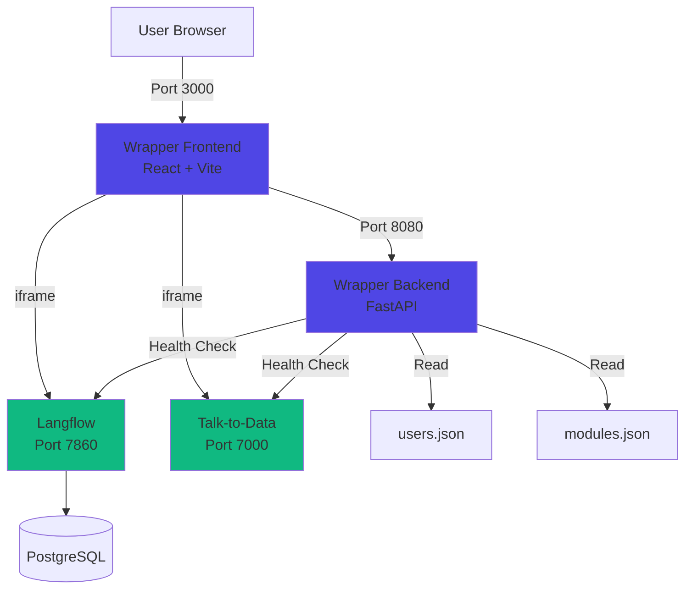

# AI Platform Wrapper

> **MVP Demonstration** - A lean wrapper application that integrates multiple AI modules into a single, cohesive platform.

## Overview

The AI Platform Wrapper unifies independently developed AI tools (Langflow, Talk-to-Data) into one platform with centralized authentication, navigation, and consistent UI/UX.

### Architecture



## Key Features

- **Simple Authentication** - File-based credentials (username/password)
- **Module Health Checks** - Real-time availability status
- **iframe Isolation** - Each module runs independently
- **Dark Mode UI** - Styled after Langflow's design system
- **Docker Compose** - One-command deployment

## Quick Start

### Prerequisites

- Docker & Docker Compose
- Ports available: 3000, 7000, 7860, 8080

### 1. Start All Services

```powershell
docker-compose up --build
```

### 2. Access the Platform

Open your browser to: **http://localhost:3000**

### 3. Login

**Default Credentials:**
- Username: `admin`
- Password: `admin`

### 4. Select a Module

Click on a module in the sidebar:
- **Workflow Builder** (Langflow) - Visual AI pipeline builder
- **Talk to Data** - Natural language database queries

## Port Mapping

| Service | Port | Description |
|---------|------|-------------|
| Wrapper Frontend | 3000 | Main UI entry point |
| Wrapper Backend | 8080 | Authentication & module API |
| Langflow | 7860 | Workflow builder module |
| Talk-to-Data | 7000 | Database query module |
| PostgreSQL | 5432 | Langflow database |
| MCP Mail | 8001 | Email MCP server (backend) |
| Email Agent | 8000 | Webhook handler (backend) |

## Project Structure

```
ai_platform_wraper/
├── backend/
│   ├── main.py              # FastAPI application
│   ├── users.json           # User credentials
│   ├── modules.json         # Module registry
│   ├── requirements.txt     # Python dependencies
│   └── Dockerfile
├── frontend/
│   ├── src/
│   │   ├── App.jsx          # Main application logic
│   │   ├── components/
│   │   │   ├── Login.jsx    # Login form
│   │   │   ├── Layout.jsx   # Sidebar & navigation
│   │   │   └── ModuleFrame.jsx  # iframe wrapper
│   │   └── index.css        # Dark theme styles
│   ├── package.json
│   ├── vite.config.js
│   └── Dockerfile
├── README.md
└── ARCHITECTURE.md
```

## How to Add a New Module

### 1. Ensure Module Exposes `/health` Endpoint

```python
@app.get("/health")
def health():
    return {"status": "healthy"}
```

### 2. Add to Docker Compose

Edit `docker-compose.yml`:

```yaml
  my-new-module:
    build: ./path/to/module
    ports:
      - "9000:9000"
    networks:
      - langflow-network
    healthcheck:
      test: ["CMD", "curl", "-f", "http://localhost:9000/health"]
```

### 3. Register in Module Configuration

Edit `backend/modules.json`:

```json
{
  "id": "my-module",
  "name": "My New Module",
  "description": "What it does",
  "url": "http://my-new-module:9000",
  "healthEndpoint": "/health",
  "icon": "tool",
  "category": "tools"
}
```

### 4. Restart Services

```powershell
docker-compose restart wrapper-backend wrapper-frontend
```

The new module will appear in the sidebar automatically!

## API Endpoints

### Backend (Port 8080)

| Endpoint | Method | Auth | Description |
|----------|--------|------|-------------|
| `/auth/login` | POST | No | Authenticate user, returns JWT |
| `/modules` | GET | Yes | List modules with health status |
| `/health` | GET | No | Backend health check |

### Authentication

Login request:
```json
POST /auth/login
{
  "username": "admin",
  "password": "admin"
}
```

Response:
```json
{
  "access_token": "eyJhbGc...",
  "token_type": "bearer"
}
```

Use token in subsequent requests:
```
Authorization: Bearer <access_token>
```

## Development

### Run Backend Locally

```powershell
cd ai_platform_wraper/backend
pip install -r requirements.txt
python main.py
```

Backend will run on http://localhost:8080

### Run Frontend Locally

```powershell
cd ai_platform_wraper/frontend
npm install
npm run dev
```

Frontend will run on http://localhost:3000

## Troubleshooting

### Module Shows as Unavailable

1. Check if module container is running:
   ```powershell
   docker ps | findstr <module-name>
   ```

2. Check module health endpoint:
   ```powershell
   curl http://localhost:<port>/health
   ```

3. View container logs:
   ```powershell
   docker logs <container-name>
   ```

### Login Fails

- Verify backend is running: http://localhost:8080/health
- Check browser console for CORS errors
- Ensure credentials match `backend/users.json`

### Iframe Not Loading

- Check browser console for Content-Security-Policy errors
- Verify module URL in `backend/modules.json`
- Ensure module allows iframe embedding (X-Frame-Options)

## Security Notes (MVP)

⚠️ **This is an MVP for demonstration purposes:**

- Passwords stored in plain text
- No HTTPS/TLS
- Simple JWT without refresh tokens
- No rate limiting
- Local deployment only

**Do not use in production without proper security hardening.**

## Technology Stack

| Component | Technology |
|-----------|-----------|
| Backend | Python 3.11, FastAPI, uvicorn |
| Frontend | React 18, Vite, Tailwind CSS |
| Auth | JWT (python-jose) |
| HTTP Client | httpx |
| Database | PostgreSQL 16 |
| Deployment | Docker Compose |

## License

MIT - See individual module licenses for their respective terms.

## Architecture Details

For detailed architectural decisions and design patterns, see [ARCHITECTURE.md](ARCHITECTURE.md).
